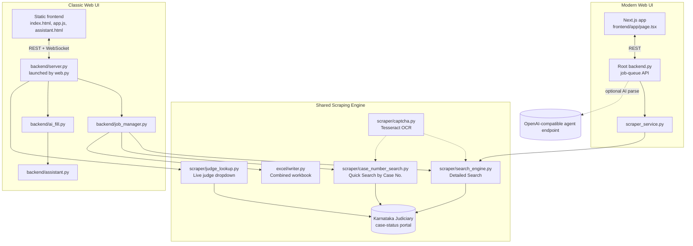

# Iudicium


> An automated case-search and reporting tool for the Karnataka Judiciary case-status portal, with two web front ends, a conversational AI assistant for building searches, and consolidated Excel export.

Iudicium drives the Karnataka Judiciary's case-status search page (`rep_judgment.php`) end to end: it fills in the real search form, solves the site's CAPTCHA with OCR, works through every matching result, opens each case's detail page, and compiles everything into a single Excel workbook — one summary sheet plus one detail sheet per case. It also supports the site's separate "Quick Search by Case No." page for direct lookups.

The project exposes this scraper through two independent web front ends built at different points in the project's life, both described below, and a conversational assistant that turns a plain-English request into validated search parameters.

## Table of Contents

- [Overview](#overview)
- [Key Features](#key-features)
- [Technology Stack](#technology-stack)
- [System Architecture](#system-architecture)
- [Repository Structure](#repository-structure)
- [Search Pipeline](#search-pipeline)
- [Conversational Assistant](#conversational-assistant)
- [Case Detail Sections](#case-detail-sections)
- [Installation](#installation)
- [Running the Application](#running-the-application)
- [Configuration Reference](#configuration-reference)
- [API Reference](#api-reference)
- [Output](#output)
- [Operational Notes](#operational-notes)
- [License](#license)

## Overview

The Karnataka Judiciary's judgment-search portal is a manual, form-driven website with no public API. Iudicium reproduces the exact behavior of the site's own form (same field IDs, same dropdown values, same 90-day date-window limit) through a headless browser, so that a search that would take many manual page loads and CAPTCHA solves can be run once and exported as a single, structured Excel file.

On top of the scraping engine, the project provides:

* A form-based search UI covering every field the live site exposes.
* A conversational "describe your search" assistant that fills the form from natural language, validates the result against the same rules as the manual form, and only ever interprets language — it never touches the target website itself.
* Live progress and log streaming over WebSocket while a search runs.
* A combined Excel export with one row per case in a summary sheet and a full detail sheet per case.

## Key Features

### Search Capability

* Full Detailed Search: judge, author judge, coram, case type, case number, case year, petitioner/respondent name and advocate, date-of-order range, report type, and multi-alias search.
* Quick Search by Case Number: bench, case type, case number, and case year only, matching the site's own dedicated lookup page.
* Automatic 90-day date-window splitting for long date ranges, transparent to the caller.
* Automatic CAPTCHA solving via Tesseract OCR, with retry on failure.
* Duplicate detection across aliases and date windows.
* Early cancellation mid-run, with partial results still saved.

### AI Assistant

* Natural-language request parsing into structured, validated search fields.
* Conversational, multi-turn field collection with follow-up questions for anything missing.
* Server-side validation against the live site's own field values — the model can never submit an invalid or unvalidated value.
* Configurable LLM backend: Gemini or any OpenAI-compatible endpoint (OpenAI, Groq, a local Ollama or vLLM server).

### Reporting

* Combined `.xlsx` workbook: one summary sheet plus one detail sheet per case.
* Every case-detail section the live site exposes (party information, daily orders, linked cases, judgment information, fees, and more).
* Judgment PDF capture alongside the workbook where available.

### Delivery

* Two independent web front ends over the same scraping engine (see [System Architecture](#system-architecture)).
* Live activity log and progress bar over WebSocket.
* Downloadable workbook served directly from the backend.

## Technology Stack

| Layer                      | Technology                                          |
| --------------------------- | ---------------------------------------------------- |
| Browser automation          | Playwright (sync API)                                |
| CAPTCHA solving              | Tesseract OCR via `pytesseract`                       |
| Backend framework (primary)  | FastAPI (`backend/server.py`, served by `web.py`)     |
| Backend framework (alternate)| FastAPI (root `backend.py`, job-queue style)          |
| Programming language         | Python 3.11+                                          |
| Spreadsheet export            | pandas + openpyxl                                     |
| Classic web front end         | Static HTML, CSS, vanilla JavaScript                  |
| Modern web front end           | Next.js 16, React 19, TypeScript, Tailwind CSS 4       |
| Data fetching (Next.js UI)     | `@tanstack/react-table`, native `fetch`                |
| AI assistant transport         | `httpx` against Gemini or an OpenAI-compatible API      |
| Real-time updates               | WebSocket (FastAPI native)                             |
| Configuration                    | `python-dotenv`, `.env`                                |
| License                           | Apache License 2.0                                     |

## System Architecture

Iudicium ships two separate front ends over the same underlying Playwright-driven scraper. They were built at different stages of the project and are not meant to run together against the same backend process.



### Classic web UI

The original, full-featured UI: a static HTML/CSS/JavaScript front end served directly by FastAPI, talking to `backend/server.py` (started with `python web.py`). This is the most complete surface — it exposes every search field, the conversational assistant, live WebSocket logs, judge lookups, and the Excel/PDF download endpoints.

### Modern web UI

A newer Next.js/React front end (`frontend/app/`) built against a separate, simpler FastAPI backend at the project root (`backend.py`), which wraps a leaner `scraper_service.py` and tracks searches as background jobs polled over REST rather than streamed over WebSocket. It also exposes an optional natural-language `/api/agent/parse` endpoint against any OpenAI-compatible chat completions API.

Pick one backend to run depending on which front end you want:

| Front end | Backend to run | Entry point |
| --- | --- | --- |
| Classic (static HTML) | `backend/server.py` | `python web.py` |
| Modern (Next.js) | root `backend.py` | `uvicorn backend:app --reload` |

## Repository Structure

```text
legal/
│
├── config.py                   # URLs, form field values, and case-detail section order
├── web.py                      # entry point for the classic UI's backend
├── backend.py                  # entry point/app for the modern (Next.js) UI's backend
├── scraper_service.py          # lean scraping wrapper used by backend.py
├── requirements.txt
├── .env.example                 # web backend config (LLM keys, scraper options)
├── LICENSE
├── NOTICE
│
├── scraper/
│   ├── search_engine.py         # orchestrates a full Detailed Search run
│   ├── case_number_search.py    # orchestrates a Quick Search by Case No. run
│   ├── judge_lookup.py          # live Judge / Author Judge dropdown lookup
│   ├── captcha.py                # CAPTCHA screenshot capture + OCR
│   ├── table_utils.py            # locates the judgments results table
│   ├── case_extraction.py        # extracts each case's detail sections
│   ├── pdf_capture.py             # captures the judgment PDF where available
│   ├── section_structure.py        # structured section parsing
│   ├── text_utils.py               # cleaning, sheet-name/filename sanitizing
│   └── date_utils.py                # date parsing and 90-day window splitting
│
├── excel/
│   └── writer.py                    # builds the combined .xlsx workbook
│
├── backend/                        # classic UI's FastAPI app (used by web.py)
│   ├── server.py                     # routes, static file mount, WebSocket log stream
│   ├── job_manager.py                 # background search job, one at a time
│   ├── assistant.py                    # conversational request -> validated fields
│   ├── ai_fill.py                       # one-shot natural language -> form values
│   ├── llm.py                            # thin Gemini / OpenAI-compatible transport
│   └── schemas.py                        # request/response models
│
└── frontend/                        # both front ends live here
    ├── index.html, assistant.html,    # classic UI pages
    │   case-number.html, search.html,
    │   guide.html, faq.html
    ├── app.js, chat.js, case-number.js, # classic UI client logic
    │   sidebar.js, conn-status.js
    ├── styles.css
    ├── app/                            # modern UI (Next.js App Router)
    │   ├── page.tsx
    │   └── layout.tsx
    ├── lib/
    │   └── api.ts                       # modern UI's API client
    ├── package.json
    └── next.config.ts
```

## Search Pipeline

### Detailed Search

1. The caller (form, or assistant) supplies bench, optional filters, and either a date-of-order range or a complete case identity.
2. A long date range is automatically split into consecutive 90-day windows.
3. Playwright opens the live search page, fills every field exactly as the site's own form expects, and solves the CAPTCHA via OCR, retrying on failure.
4. Each matching row in the results table is opened, and every available detail section is extracted.
5. Duplicate cases (found through more than one alias or date window) are skipped and counted in the final summary.
6. All collected cases are written to a single combined Excel workbook: one summary row per case, one full detail sheet per case.

### Quick Search by Case Number

When a request is exactly bench + case type + case number + case year, Iudicium instead drives the site's separate "Quick Search by Case No." page, which returns a single case's summary block directly rather than a results table. No date range is required for this mode, matching the live site's own validation.

## Conversational Assistant

The assistant (`backend/assistant.py`) turns a chat conversation into validated search parameters:

* Every value the model proposes is checked against `config.py` — bench, case type code, case year, coram, report type, and date format are all validated in Python, not trusted from the model's output.
* The "ready to search" rule is enforced in code, not by the model: bench is always required, and either a date-of-order range or a complete case identity (type, number, year) must be present.
* Which scraper mode to run is decided by the same code: an exact case-identity request uses the Quick Search path, everything else uses the Detailed Search path.
* If the model claims a search is ready but the validation rules disagree, the rules win, and the missing fields are surfaced back to the user as a follow-up question.
* The assistant only ever interprets language. It never talks to the target website — the Playwright scraper does that, and only after validation.

## Case Detail Sections

Every detail sheet can include the following sections, in the order the live site presents them:

| Section | Section |
| --- | --- |
| Case Information | Certified Copy Information (Final Order) |
| Prayer Information | Certified Copy Information (Interim Order) |
| Party Information | Index Sheet Information |
| Caveator/Caveatee Information | Scrutiny Information |
| Trial/Appellate Information | Interlocutory Applications (IA) Information |
| Supreme Court Appellate Information | Documents Information |
| Daily Orders Information | Postal Information |
| Linked Cases | Judicial Deposit |
| Judgment Information | Fees Information |

## Installation

```bash
pip install -r requirements.txt
playwright install chromium
```

Tesseract OCR is a system binary, not a Python package, and must be installed separately:

* Windows: https://github.com/UB-Mannheim/tesseract/wiki
* macOS: `brew install tesseract`
* Linux: `sudo apt install tesseract-ocr`

The scraper looks for Tesseract automatically; if it cannot find it, set `TESSERACT_CMD` in `.env`.

For the modern (Next.js) UI, also install the front-end dependencies:

```bash
cd frontend
npm install
```

## Running the Application

### Classic web UI

```bash
cp .env.example .env      # fill in an LLM key for the AI assistant, if wanted
python web.py
```

Open `http://localhost:8000`. This serves the full form-based UI, the AI assistant page, live WebSocket progress and logs, judge lookups, and the Excel download endpoint, all from a single process.

### Modern (Next.js) web UI

Run the backend:

```bash
uvicorn backend:app --reload --port 8000
```

Run the front end in a separate terminal:

```bash
cd frontend
npm run dev
```

Open `http://localhost:3000`. Set `NEXT_PUBLIC_API_URL` (for example in `frontend/.env.local`) to point the front end at the backend, for example:

```text
NEXT_PUBLIC_API_URL=http://localhost:8000
```

## Configuration Reference

All configuration is read from `.env` (see `.env.example`):

```bash
# LLM provider for the AI assistant / AI-fill feature.
LLM_PROVIDER=gemini

# Gemini (https://aistudio.google.com/apikey)
GEMINI_API_KEY=
GEMINI_MODEL=gemini-3.6-flash

# OpenAI-compatible endpoint (OpenAI, Groq, a local Ollama/vLLM server, etc.)
OPENAI_API_KEY=
OPENAI_MODEL=gpt-4o-mini
OPENAI_BASE_URL=https://api.openai.com/v1

# Scraper options
TESSERACT_CMD=
SCRAPER_HEADLESS=true

# Web server (classic UI)
HOST=127.0.0.1
PORT=8000
```

API keys are read from environment variables on the server only; they are never sent to or exposed in the browser. If no key is configured, the AI assistant reports an error and the manual form continues to work normally.

The modern UI's backend additionally reads `AGENT_API_KEY`, `AGENT_BASE_URL`, and `AGENT_MODEL` for its own natural-language parsing endpoint.

## API Reference

### Classic UI backend (`backend/server.py`)

| Method | Route | Purpose |
| --- | --- | --- |
| GET | `/api/form-options` | Static dropdown data: case types, years, coram, bench, report type |
| POST | `/api/judges` | Live Judge / Author Judge options for a given bench |
| POST | `/api/ai-fill` | One-shot natural language to structured field values |
| POST | `/api/assistant` | Conversational turn: reply, validated fields, readiness |
| POST | `/api/assistant/run` | Starts the appropriate scraper from validated fields |
| POST | `/api/search` | Starts a Detailed Search job |
| POST | `/api/search/stop` | Requests early cancellation of the running search |
| POST | `/api/case-number-search` | Starts a Quick Search by Case No. job |
| GET | `/api/search/status` | Whether a search is currently running |
| GET / DELETE | `/api/logs/{page}` | Read or clear the buffered activity log for a page |
| WS | `/ws/logs` | Live log lines, progress, and final results |
| GET | `/outputs/{filename}` | Download a finished workbook |

### Modern UI backend (root `backend.py`)

| Method | Route | Purpose |
| --- | --- | --- |
| GET | `/health` | Health check |
| POST | `/api/agent/parse` | Natural language to structured search request |
| POST | `/api/searches` | Starts a search job, returns a job ID |
| POST | `/api/searches/{job_id}/cancel` | Requests cancellation of a job |
| GET | `/api/searches/{job_id}` | Job status and progress |
| GET | `/api/searches/{job_id}/results` | Completed job's results |

## Output

Every completed run produces a single `.xlsx` workbook containing:

* A **Summary** sheet with one row per case found.
* One **detail sheet per case**, containing every section listed in [Case Detail Sections](#case-detail-sections) that has data for that case.

Where available, the judgment PDF is captured alongside the workbook. Generated files are written to the `outputs/` directory and are not committed to version control.

## Operational Notes

* The live site limits each date-of-order query to a 90-day window; longer ranges are split into consecutive windows automatically.
* CAPTCHA solving is automatic, with up to five retries per search.
* Duplicate cases found through more than one alias or date window are skipped and counted in the final summary.
* A Case Number search (case type, case number, and case year all supplied) does not require a date range, matching the live site's own validation rule; every other combination requires a Date of Order range.
* Every field in `config.py` (case types, case years, coram options, report type options, bench options) was read directly out of the live site's HTML and JavaScript, not guessed.
* Only one search runs at a time per backend process, matching the constraint of driving a single browser session; starting a new search while one is running is rejected until it stops or finishes.

## License

Licensed under the Apache License 2.0. See [LICENSE](LICENSE) and [NOTICE](NOTICE).
